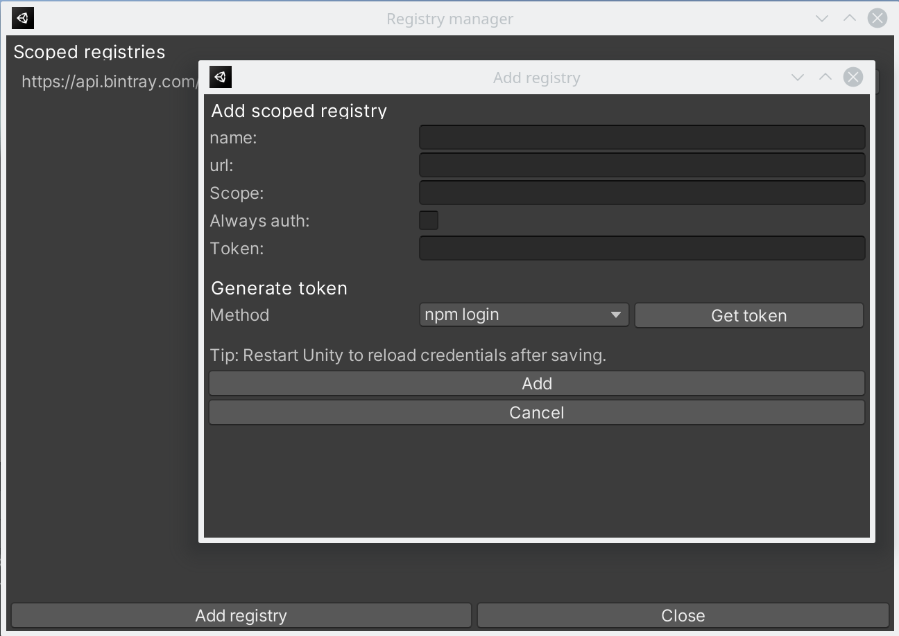

# Halodi Unity Package Registry Manager

This package provides a simple UI to edit scoped registries and set credentials.

To manage package creation and publication, take a look at [Halodi Unity Package Creator  ](https://github.com/Halodi/halodi-unity-package-creator).



## License

Apache 2.0

## Installation

In Unity, go to Window -> Package Manager.

Add package from git url (press the + in the top left of the Window). Use the repository URL for this package:

```
https://github.com/Halodi/halodi-unity-package-registry-manager.git
```

## Usage 

After installation a new menu "Packages" will appear.

### Manage credentials

Under "Manage credential" you can add, edit and remove credentials in ~/.upmconfig.toml. 

Each registry logs in using a token. If your NPM provider provides a token directly, enter it here. If your provider requires a login, select the method and press "Get Token". Enter required information and press "Login". A token will be requested from the registry. The login information will not get saved.

To always authenticate, set "Always auth" to true;

After setting the registry credentials, it is advised to restart Unity to reload the package manager.

#### Notes for specific providers

**Github**: Create a [Personal access token](https://help.github.com/en/github/authenticating-to-github/creating-a-personal-access-token-for-the-command-line), make sure to select "read:packages" for adding packages to a project and "write:packages" if you want to publish packages. Copy the personal access token directly in the "Token" field (ignore Generate Token).

**Bintray**: In Generate Token, select "bintray" as method and press "Get token". Enter your credentials. Note: Your credentials are not checked here, the token is calculated from your credentials.

**Verdaccio**: In Generate Token, select "npm login" as method and press "Get token". Enter your credentials.

### Manage scoped registries

Using "Manage scoped registries" you can add, edit and remove scoped registries from the projects package manifest.json.

In the same dialog, you can set the credentials for scoped registries. If no token is set, the credentials will be removed from the credential database. For more information, see "Manage credentials".

Note: The authentication settings are saved per-computer, not per project. If you have multiple projects with the same scoped registry, the authentication parameters will be shared.

### Add Packages (Bulk)

Utility to add a list of packages. 

Utility could include

- Sharing a list of packages to be bulk imported a project by copy-pasting
- Adding packages when the registry does not support listing all packages

Note: The Editor will freeze while downloading the packages. This is expected. A popup with the imported packages will appear when done.


## Library functions

This library provides basic NPM functionality in [Halodi.PackageRegistry.NPM](Editor/Halodi/PackageRegistry/NPM.cs). The following functions are implemented


### NPM.GetLoginToken(string url, string user, string password)

Same as "npm login --registry [url]". Returns a NPMResponse struct. 

If succesfull, NPMResponse.ok will be set and NPMResponse.token will contain the token.
If a fault happend, NPMREsponse.error will be set to the error.

### NPM.Publish(string packageFolder, string registry)

Same as "npm publish --registry [registry]" executed in "packageFolder".

The publish functionality uses the credentials set in "~/.upmconfig.toml" to publish to the registry. Use "Manage registries" to set the credentials.

The package tarball is created using SharpZipLib, to avoid compatibility issues with PackageManager.Client.Pack() in Unity.

Throws a System.IO.IOException if an error occurs.

## Bugs and feature requests

Please open a ticket on Github. Pull requests are encouraged.

## Maintainer

[Jesper](jesper@halodi.com)
