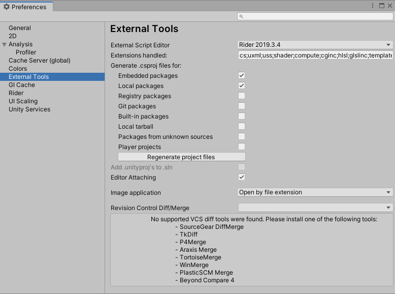
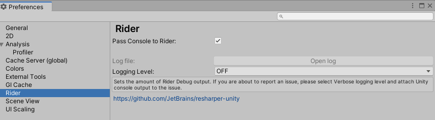

# Using the JetBrains Rider Editor package

To use the package, go to **Edit &gt; Preferences &gt; External Tools**, click on the **External Script Editor** dropdown menu and select your version of **Rider**. When you select this option, the window reloads.

After the window reloads, new settings that control production of .csproj files become available.

  
*External Tools tab in the Preferences window*

## Commandline endpoints

Q: Generate sln/csproj files for CI?

A: `Unity -batchmode -quit -projectPath ProjectPath -executeMethod Packages.Rider.Editor.RiderScriptEditor.SyncSolution`

Q: Generate sln/csproj and open External Editor?

A: `Unity -batchmode -quit -projectPath ProjectPath -executeMethod Packages.Rider.Editor.RiderScriptEditor.SyncSolutionAndOpenExternalEditor`

## Package preferences

|**Property:** |**Description:** |
|:---|:---|
|__Extensions handled__| This field lists the file extensions that open in JetBrains Rider. This field contains a variety of extensions by default. |
|__Generate .csproj files for:__ | Each setting in this list enables or disables production of .csproj files for a different type of package. The **Regenerate project files** button updates existing .csproj files and creates the necessary new ones based on the settings you choose. These settings control whether to generate .csproj files for any installed packages. For more information on how to install packages, see the [Adding and removing packages documentation](https://docs.unity3d.com/Manual/upm-ui-actions.html). |
|__&nbsp;&nbsp;&nbsp;&nbsp;Embedded &nbsp;&nbsp;&nbsp;&nbsp;packages__ | Any package that appears under your project’s Packages folder is an embedded package. An embedded package is not necessarily built-in; you can create your own packages and embed them inside your project. This setting is enabled by default. For more information on embedded packages, see the [Embedded dependencies documentation](https://docs.unity3d.com/Manual/upm-embed.html). |
|__&nbsp;&nbsp;&nbsp;&nbsp;Local &nbsp;&nbsp;&nbsp;&nbsp;packages__ | Any package that you install from a local repository stored on your machine, but from outside of your Unity project. This setting is enabled by default. |
|__&nbsp;&nbsp;&nbsp;&nbsp;Registry &nbsp;&nbsp;&nbsp;&nbsp;packages__ | Any package that you install from either the official Unity registry or a custom registry. Packages in the Unity registry are available to install directly from the Package Manager. For more information about the Unity package registry, see the [Package Registry section of the Unity Package Manager documentation](https://docs.unity3d.com/Packages/com.unity.package-manager-ui@1.8/manual/index.html#PackManRegistry). For information on creating and using custom registries in addition to the Unity registry, see the [Scoped package registries documentation](https://docs.unity3d.com/Manual/upm-scoped.html). |
|__&nbsp;&nbsp;&nbsp;&nbsp;Git &nbsp;&nbsp;&nbsp;&nbsp;packages__ | Any package you install directly from a Git repository using a URL. |
|__&nbsp;&nbsp;&nbsp;&nbsp;Built-in &nbsp;&nbsp;&nbsp;&nbsp;packages__ | Any package that is already installed as part of the default Unity installation. |
|__&nbsp;&nbsp;&nbsp;&nbsp;Tarball &nbsp;&nbsp;&nbsp;&nbsp;packages__ | Any package you install from a GZip tarball archive on the local machine, outside of your Unity project. |
|__&nbsp;&nbsp;&nbsp;&nbsp;Unknown &nbsp;&nbsp;&nbsp;&nbsp;packages__ | Any package which Unity cannot determine an origin for. This could be because the package doesn’t list its origin, or that Unity doesn’t recognize the origin listed. |
|__Player projects__ | For each player project, generate an additional .csproj file named 'originalProjectName.Player.csproj'. This allows different project types to have their code included in Rider’s systems, such as assembly definitions or testing suites. |

This package also adds a second tab under **Preferences** named **Rider**, pictured below.

 *Rider tab in the Preferences window*

> [!NOTE]
> The Logging Level menu does not control the level of Unity's logging, only the level of log messages that Rider package logs in its own log file. For more information on controlling Unity's logging level, see the [Stack Trace Logging section of the Console Window documentation](https://docs.unity3d.com/Manual/Console.html#StackTraceLogging).

|**Property:** |**Description:** |
|:---|:---|
|__**Pass Console to Rider**__| If **Pass Console to Rider** is enabled, Rider can access data that Unity sends to the Unity Console and display it within its own environment instead. |
|__**Log file**__ | The **Log file** field contains an **Open log** button. Select this button to open the log file inside the Rider IDE. This button is unavailable when **Logging Level** is set to **OFF**.  |
|__Logging Level__ | The **Logging Level** menu controls how detailed are the Rider package logs. Those logs may be used for troubleshooting communication between Rider and Unity. Rider package logs all messages of the type you select as well as any messages of a more severe type. For example, if you choose **WARN**, then Rider logs all **ERROR** and **FATAL** messages as well as **WARN** messages. The message types are listed below in order of severity, with **FATAL** as the most severe type of message and **TRACE** as the least severe. |
|__**OFF**__ | Rider does not produce any logs. |
|__**FATAL__ | Logs information relating to serious problems that cause the application to crash. This setting produces the smallest logs. |
|__**ERROR**__ | Logs information about errors that prevent some functionality from working, but don’t cause the application to fail (for example, a failed database connection). |
|__**WARN**__ | Logs information about possible problems, or any unusual behaviour. Warnings don’t indicate that something has gone wrong, but that Unity detects something that might potentially cause an issue if not investigated. |
|__**INFO**__ | Logs information about normal operation of the application, such as a successful database connection attempt. |
|__**VERBOSE**__ | Logs detailed but not exhaustive information about your code. This setting is helpful for checking how your code executes or providing diagnostic information for other developers. |
|__**TRACE**__ | Logs as much information about the application as possible. This can create a very large and detailed log, so it’s good practice to only use it when attempting to find the cause of a specific issue with your code. |
